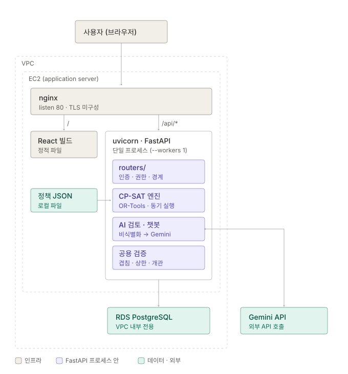

# 아키텍처

**이 시스템이 어떻게 조립돼 있는가**를 적습니다. 컴포넌트 구성, 모듈 경계, 요청이
거치는 경로, 상태 전이입니다.

다른 축은 다른 문서가 담당합니다 — 중복해서 적지 않고 링크합니다.

| 알고 싶은 것 | 문서 |
|---|---|
| 무엇을 왜 만드는가 (도메인·용어·요구사항) | [STREAM_CONTEXT.md](STREAM_CONTEXT.md) |
| 엔드포인트별 입출력 | [API_SPEC.md](API_SPEC.md) |
| 테이블과 관계 | [ERD.md](ERD.md) |
| 누가 무엇에 닿는가 (인증·권한) | [AUTH_SPEC.md](AUTH_SPEC.md) |
| AI 경로의 비식별화·검증·계측 | [AI_SYSTEM.md](AI_SYSTEM.md) |
| 화면 구조·역할별 접근 | [IA_AND_SCREENS.md](IA_AND_SCREENS.md) |
| 디자인 토큰·컴포넌트 | [DESIGN_SYSTEM.md](DESIGN_SYSTEM.md) |
| 알려진 한계·향후 계획 | [RISKS.md](RISKS.md) |
| 솔버 제약과 목적함수 | [SCHEDULER_SPEC.md](SCHEDULER_SPEC.md) |
| 어디에 어떻게 올리는가 | [DEPLOY.md](DEPLOY.md) |

---

## 1. 컴포넌트 구성



그림이 담고 있는 사실은 넷입니다.

- **uvicorn은 워커 하나짜리 단일 프로세스입니다.** CP-SAT가 가용 코어를 전부 쓰기
  때문에 2 vCPU에서 워커를 늘리면 서로 뺏습니다 ([DEPLOY.md](DEPLOY.md)).
- **CP-SAT는 별도 서비스가 아닙니다.** 잡 큐 없이 `POST /api/schedule/generate`
  요청 안에서 풀고 응답합니다(해 하나당 기본 30초 제한). nginx의
  `proxy_read_timeout`이 180초인 이유가 이것입니다.
- **솔버가 읽는 부서 정책·학사 달력은 DB가 아니라 EC2 로컬 JSON입니다**
  (`app/scheduler/config/`). 그래서 정책을 고치려면 배포가 필요합니다.
- **Gemini는 VPC 밖입니다.** EC2에서 나가는 아웃바운드 호출이라, 끊겨도 서비스는
  계속 돕니다 — AI 검토는 `review_available: false`로 내려갑니다.

> nginx는 **80만 듣습니다.** 보안그룹에 443이 열려 있지만 TLS는 아직 붙이지
> 않았습니다.

| 층 | 스택 |
|---|---|
| 프론트 | React 18 · Vite 6 · react-router 7 (`frontend/package.json`) |
| API | FastAPI 0.139 · Pydantic 2 · SQLAlchemy 2.0 · PyJWT (`backend/requirements.txt`) |
| 솔버 | OR-Tools CP-SAT 9.15 |
| DB | RDS PostgreSQL (JSONB 컬럼 사용 — 정책·툴 호출 로그) |
| LLM | Google Gemini (`google-genai`) |

**서비스 런타임이 부르는 LLM은 Gemini뿐입니다.** `requirements.txt`의 `openai`·
`anthropic`은 평가 하네스(`scripts/eval_review.py --provider`)가 같은 케이스를 다른
모델로 채점해 비교할 때만 씁니다 — 서비스 경로에서는 불리지 않습니다.

**프론트와 API가 같은 오리진입니다.** 프론트는 `fetch('/api...')`로 상대경로만 쓰고
(`frontend/src/api/client.js`), nginx가 같은 호스트에서 백엔드로 넘깁니다. 그래서

- **CORS가 발생하지 않습니다** — 운영 `.env`의 `CORS_ORIGINS`는 비어 있습니다.
- **API 주소가 빌드에 박히지 않습니다** — 백엔드 주소가 바뀌어도 프론트를 다시
  빌드할 필요가 없습니다.

배포는 서버가 코드를 당겨오지 않고 **CI가 만든 아티팩트를 S3 경유로 밀어 넣습니다**
(GitHub Actions → OIDC → S3 → SSM Run Command → EC2). 인바운드 포트를 열지 않아도
됩니다. 상세는 [DEPLOY.md](DEPLOY.md).

> **스키마 마이그레이션은 배포에 자동으로 따라갑니다.** `app/schema_patches.py`가
> `main.py` 모듈 최상단에서 실행되므로, 배포 스크립트의 `systemctl restart stream`이
> 곧 마이그레이션 적용입니다. 반면 **시드 데이터는 따라가지 않습니다** — DB는 EC2
> 밖 RDS에 있는 별도 자산이라 수명주기가 다릅니다.

---

## 2. 모듈 경계

### 백엔드

```
app/
├── routers/          HTTP 경계 — 인증·권한·요청 검증·트랜잭션 경계
│   ├── schedule.py         근무표 생성·확정·draft 편집·가능시간
│   ├── substitutes.py      대타 요청·수락·승인
│   ├── schedule_chat.py    시간표 검토 챗봇 세션
│   ├── postings.py · applications.py · students.py
│   └── auth.py · academic.py · class_time.py · course_ta.py
│
├── scheduler/        도메인 로직 — HTTP를 모른다 (Request/Response를 다루지 않음)
│   ├── service.py          배정 파이프라인 진입점
│   ├── domain/             정책·달력·시간격자·학생 등 값 객체
│   ├── loader/             DB → 도메인 객체 변환
│   ├── constraints/        hard.py · soft.py — CP-SAT 제약 정의
│   ├── engine/solver.py    CP-SAT 실행
│   ├── reporting.py        해 → 근무표 행 (merge_blocks가 연속 슬롯을 한 행으로)
│   ├── review.py           AI 검토      chat.py            챗봇 툴 루프
│   ├── substitute_check.py 대타 적합성   note_suggest.py    특이사항 → 슬롯 제안
│   ├── verify.py           제약 위반 재검증
│   └── deidentify.py       LLM 전송 전 식별자 치환
│
├── (공용 규칙)       라우터와 도메인이 함께 쓰는 판정 규칙
│   ├── overlap.py              같은 학생·같은 날짜 근무 겹침
│   ├── work_hours.py           주간 근로 상한 (부서 운영 + 재원별 법정)
│   ├── opening_hours.py        개관 시간·휴관일
│   └── substitute_overrides.py 승인된 대타 재적용·분할
│
└── models.py · schemas.py · auth.py · database.py · schema_patches.py
```

#### 공용 검증 모듈 — 다경로 일관성

**공용 규칙 모듈이 따로 있는 이유가 이 구조의 핵심입니다.** 같은 규칙을 라우터마다
다시 구현하면 경로에 따라 판정이 갈립니다. 실제로 그렇게 생긴 버그가 반복됐고,
그때마다 규칙을 `routers/`에서 끄집어내 공용 모듈로 옮겼습니다.

| 모듈 | 담당 판정 | 끄집어낸 계기 |
|---|---|---|
| `app/overlap.py` | 같은 학생·같은 날짜 근무 시간 겹침 | `routers/schedule.py` 안에만 있어 대타 라우터가 부를 수 없었고, **대타 수락·승인이 이미 그 시간에 근무가 있는 학생을 그대로 통과**시켰다 |
| `app/work_hours.py` | 주간 근로 상한 — 부서 운영 상한과 재원별 법정 상한을 **둘 다** | 같은 모양으로 대타 승인이 상한을 지나쳤다. 승인 한 번으로 확정 근무표가 규정 위반이 되는 경로였다 (#159) |
| `app/opening_hours.py` | 개관 시간·휴관일 | 솔버는 개관 슬롯 안에서만 배정하지만 **그 뒤에 사람이 얹는 근무**(챗봇·화면 편집·수동 등록)는 검사를 안 거쳐 휴관일에도 들어갔다 (#216) |
| `app/substitute_overrides.py` | 승인된 대타 재적용·행 분할 | 확정 배치를 만드는 자리가 여럿이라 재적용을 빠뜨렸다 (#178 → #230) |

집계 규칙이 갈라진 사례도 같은 자리에서 흡수했습니다 — 낡은 draft가 확정본과
이중 집계돼 정상 배정이 거부되던 문제는 `work_hours.py`가 "한 부서에 기간이 겹치는
draft는 하나만 센다"로 정리했습니다 (#212, #227).

**근무를 새로 얹는 경로 전부가 같은 함수로 들어옵니다.**

| 경로 | 겹침 | 개관 시간 | 주간 상한 |
|---|---|---|---|
| `POST /api/schedule/confirm` — 확정 | ● | ● | ● |
| `POST /api/schedule/manual` — 수동 등록 | ● | ● | ● |
| `POST /api/schedule/draft/edits` — 화면 draft 편집 | ● | ● | ● |
| 챗봇 쓰기 툴 (`move_schedule`·`add_schedule`·`remove_schedule`) | ● | ● | ● |
| `PATCH /api/substitute-requests/{id}/respond`·`/approve` — 대타 수락·승인 | ● | — | ● |
| `POST /api/course-ta/...` — 과목 TA 배정 | 수업 시간끼리 | — | 법정 상한만 |

- draft 편집은 세 검사가 `_validate_slot_and_limits` 하나로 묶여 있습니다.
  **챗봇 쓰기 툴은 자기 검증을 두지 않고 `apply_draft_edit`를 그대로 재사용합니다**
  (#133, REQ-SCHED-018) — 대화로 고친 결과와 화면에서 고친 결과가 같은 기준을
  통과하게 하려는 것입니다.
- 대타는 개관 시간을 다시 보지 않습니다. 이미 개관 시간 안에 있는 근무의 담당자만
  바꾸는 것이기 때문입니다.
- 과목 TA는 법정 상한만 봅니다 — 부서 운영 상한은 학과 사무실 대기 근무 몫이라 TA
  시간에 그대로 걸면 실제 운영보다 좁아집니다. 그래서 TA 시간과 대기 근무 시간은
  각각 따로 상한을 봅니다.
- **되돌리기만 예외입니다.** `skip_policy_checks=True`로 개관 시간·주간 상한을
  건너뜁니다. 되돌리기는 새 배정이 아니라 직전 상태로의 복원이라, 이 검사를 걸면
  지울 수는 있는데 되돌릴 수 없는 상태에 갇힙니다 (#137). 겹침 검사는 데이터
  무결성이라 되돌리기에서도 유지합니다.

**이 세 모듈이 hard 제약 전부를 덮지는 않습니다.** 덮는 것은 겹침·`HC-OPEN`·
`HC-TIME-1/2`(+ 부서 운영 상한)이고, 나머지는 사람이 얹은 근무를 그냥 통과합니다.

| 덮지 못하는 제약 | 내용 |
|---|---|
| `HC-CLASS-1` | 학생이 제출한 근무 가능 시간 밖 |
| `HC-CLASS-6` | 학생 근로 활동 기간 밖 |
| `HC-STAFF-1/2` | 시간대별 최소·최대 인원 |
| `HC-TIME-3` | 국가근로 월 상한 |
| `HC-TIME-4` | 부서 교비 2주 총합 상한 |

이 구멍은 `scheduler/verify.py`의 `verify_batch`가 덮습니다 — **솔버와 같은 로더로
배치를 다시 채점**하므로 추가 경로가 자기만의 기준을 갖지 않습니다. 챗봇은 쓰기 툴
결과에 이번 편집이 **새로 만든** critical 위반만 얹습니다 (#195).

새 판정 규칙이 두 곳 이상에서 필요해지면 **라우터에 복사하지 말고 공용 모듈로
빼는 것**이 이 저장소의 방침입니다.

### 프론트엔드

```
src/
├── api/client.js     모든 HTTP 호출의 단일 통로 — 토큰 주입, 에러 형식 해석
├── pages/            학생 화면 12개 + admin/ 직원·관리자 화면 8개
├── components/       화면 간 공용 UI (ui/ · student/ · admin/ · layout/)
├── utils/            순수 함수 — 시간 격자, 학기 계산 등 (scheduleGrid.js 등)
├── data/             mock 데이터
└── styles/tokens.css 디자인 토큰
```

`utils/`는 **JSX가 없는 순수 함수만** 둡니다. 두 화면이 같은 계산을 하면 여기로
올려서 격자가 어긋나지 않게 합니다.

---

## 3. 핵심 흐름

### 3-1. 근무표 생성 → 검토 → 확정

```
POST /api/schedule/generate
   loader: DB → 학생 가능시간·수업시간·부서 정책·학사 달력
   constraints: hard·soft 제약을 CP-SAT 모델에 부착
   engine/solver: solve_alternatives
   reporting.merge_blocks: 연속 슬롯을 한 행으로 합쳐 저장
   → draft 배치 생성

POST /api/schedule/review
   화면이 생성에 이어 자동으로 호출한다 (#250) — 담당자가 검토 버튼을 깜빡해도
   확정 전에 의견이 남는다. 규칙 미등록·AI 실패는 review_available=false로 조용히 끝난다.

   담당자가 검토: 화면 칸 편집 / AI 검토 다시 실행 / 챗봇 대화
      (draft 편집은 POST /api/schedule/draft/edits — 한 요청 안에서 순서대로 적용)

POST /api/schedule/confirm
   기간이 겹치는 기존 confirmed → superseded
   draft를 confirmed로 승격
   _materialize_confirmed_rows(솔버 배정 + 그 기간의 승인된 대타)
```

**`merge_blocks`가 연속 근무를 한 행으로 합친다는 점이 여러 곳에 영향을 줍니다.**
화면은 부서가 정한 블록 단위로 클릭을 받는데 DB 행은 그보다 크므로, 칸 하나만
빼려면 행을 지우고 남는 앞·뒤 구간을 다시 넣어야 합니다 (#214).

### 3-2. 확정 배치는 합성 결과다

```
확정 배치 = materialize(솔버 배정, 그 기간의 승인된 대타)
```

`app/substitute_overrides.py`가 담당하고, **확정 배치를 만드는 경로는 반드시 이
함수를 거칩니다.**

이유는 [5-3](#5-3-계획과-예외를-섞지-않는다)에 적었습니다. 요약하면, 재적용을
호출부에서 기억해 부르는 구조로 두면 근무표 행을 갈아끼우는 경로가 늘 때마다
빠뜨릴 자리가 생기고 그때도 아무도 모릅니다.

### 3-3. AI 경로 (검토·챗봇·대타검사·특이사항 공통)

네 경로가 같은 모양입니다.

```
컨텍스트 조립 (DB에서 배정·정책·자연어 규칙)
   ↓
deidentify: 학번·이름 → S01, S02 …  연락처·이메일 제거
   ↓
Gemini 호출
   ↓
파싱 → 별칭을 원래 값으로 복원 → 화면
```

**식별자를 외부로 내보내지 않습니다** (`LLM_DEIDENTIFY`, 기본 켜짐). 비식별화는
프롬프트를 완성한 **뒤** 한 번에 치환합니다 — 판단에 필요한 문장은 그대로 두고
식별자만 빼기 위해서입니다.

**AI는 의견만 냅니다.** 검토는 findings를, 챗봇은 편집 제안을 내지만 확정
(`/api/schedule/confirm`)은 담당자만 호출합니다.

### 3-4. 챗봇 툴 루프

챗봇은 자유 생성이 아니라 **정해진 툴만** 부릅니다.

| 읽기 | 쓰기 |
|---|---|
| `find_schedules` · `explain_penalty` · `get_student_availability` · `get_period_calendar` · `verify_schedule` | `move_schedule` · `remove_schedule` · `add_schedule` · `adjust_weight` |

- 한 턴의 툴 호출 예산은 `STEP_BUDGET`(기본 5)입니다.
- **쓰기 툴은 다건을 한 호출에 받습니다** — `schedule_ids`·`work_dates` 배열.
  한 건씩 부르면 5건 이상 요청이 예산에 걸려 앞부분만 적용된 채 끝났습니다 (#222).
- **한 호출은 원자 단위입니다.** SAVEPOINT 안에서 건별로 적용하고 하나라도 실패하면
  되감아 아무것도 적용하지 않습니다. 부분 적용 상태를 만들지 않는 것이 목적이므로
  역연산도 전부 기록되거나 하나도 기록되지 않습니다.
- 한 턴의 쓰기는 **되돌리기 한 번으로 전부 복구**됩니다.

---

## 4. 상태 전이

### 4-1. `schedule_batch.status`

```
draft ──확정──▶ confirmed ──겹치는 기간 재확정──▶ superseded
  │                                                  (행은 남는다)
  └─ 재생성하면 이전 draft는 삭제된다
```

- 조회는 **superseded를 제외합니다.** 그래서 화면에서 사라져도 이력은 남습니다.
- `manual`은 직원이 직접 등록한 배치입니다. **확정해도 내려가지 않으므로** 겹침·상한
  검사에서 계속 셈에 들어갑니다.
- 겹침·상한 검사는 "이 draft를 확정하면 내려갈 confirmed"를 **제외하고** 봅니다
  (`_superseded_by_draft_ids`). 빼지 않으면 확정본과 초안이 이중으로 세어져 실제로는
  통과할 배정이 편집 단계에서 거부됩니다 (#212, #227).

### 4-2. `substitute_request.status`

```
대기 ──동료 수락──▶ 수락 ──직원 승인──▶ 승인 ──재확정으로 자리 없어짐──▶ 해제됨
 │                    │                                                  (종결)
 ├── 취소 (요청자)      └── 반려 (직원)
 └── 만료 (D-2 경과)
```

`해제됨`은 재확정된 근무표에 얹을 자리가 없어진 승인입니다. 원 근무자가 그 시간에
더는 근무하지 않는 경우이며, **되돌릴 수 없는 종결 상태**입니다. 확정 응답의
`released_substitutes`로 담당자에게 알립니다.

> 요청 구간이 새 계획에 **일부만** 겹치면 겹치는 만큼 적용하지 않고 해제합니다.
> 승인된 것은 "15\~17시를 B가 한다"인데 새 계획에서 원 근무자가 15\~16시만 일한다면,
> 겹치는 만큼 넘기는 것은 **B가 동의하지 않은 다른 근무를 만드는 일**입니다.

### 4-3. 두 상태가 맞물리는 지점

대타 승인은 확정 배치의 행을 앞/대타/뒤로 **쪼개서** 표현합니다. 그런데 재확정은
그 배치를 통째로 superseded로 내리고 솔버 배정으로 새 배치를 채웁니다. 여기가
#178의 무대였습니다 — 승인된 대타가 조용히 원 근무자에게 돌아갔습니다.

---

## 5. 설계 판단

### 5-1. AI는 판단 보조, 확정은 사람

검토·챗봇·대타검사 어느 것도 사람의 확정을 대체하지 않습니다. AI가 자동으로
확정하거나 삭제하는 경로는 없습니다.

### 5-2. LLM에 식별자를 보내지 않는다

학번·이름은 요청 단위 별칭으로 치환하고, 연락처·이메일은 제거한 뒤 보냅니다.
학생이 자유 서술한 특이사항·대타 사유가 그대로 나가던 것을 막기 위해서입니다 (#200).

### 5-3. 계획과 예외를 섞지 않는다

근무표에는 성격이 다른 둘이 들어 있습니다.

- **계획** — 솔버가 낸 배정. 다시 생성될 수 있고, 그래도 되는 것
- **예외** — 사람이 승인한 대타. 재생성한다고 사라지면 안 되는 것

예전에는 예외가 계획과 같은 층(`work_schedule` 행 분할)에만 존재해서, 계획을
갈아끼우면 함께 쓸려나갔습니다. 지금은 승인이
`(부서, 날짜, 시각, 넘긴 사람, 받은 사람)`이라는 **배치 독립적 좌표**로 성립하고
(#229), `schedule_id`는 "지금 반영된 행"을 가리키는 가변 포인터입니다.

### 5-4. 판정 규칙은 한 곳에서만

[2절](#2-모듈-경계)의 표에 적은 대로, 같은 규칙을 여러 경로가 각자 구현하면 경로에
따라 답이 갈립니다. 규칙이 두 곳 이상에서 필요해지면 공용 모듈로 뺍니다.

### 5-5. 실측하지 않은 수치는 적지 않는다

스케줄러·AI 변경은 [LOG.md](../LOG.md)에 문제 → 테스트 조건 → Before → 수정 → After로
남기고, **수치는 실제 실행 결과만** 적습니다. Solver status와 solve time을 함께
남기는 것도 같은 이유입니다 — `OPTIMAL`과 `FEASIBLE`은 신뢰도가 다릅니다.

---

## 알려진 한계

문서가 현재 구조를 기록하는 것이므로, 지금 불편한 점도 함께 적습니다.

- **정식 마이그레이션 도구가 없습니다.** `schema_patches.py`가 `ADD COLUMN IF NOT
  EXISTS`와 멱등 UPDATE로 대신하고 있습니다. 컬럼 추가·역채움까지는 되지만 컬럼
  삭제·타입 변경은 다루지 못합니다.
- **`response_model`이 없는 엔드포인트가 9건** 있습니다 (솔버·AI 응답 위주). 응답
  형식은 일관하지만 스키마가 OpenAPI에 잡히지 않습니다 (#78).
- **AI 성능 계측기가 포화 상태입니다.** eval 케이스를 전부 통과해서 다음 변경이
  좋아졌는지 나빠졌는지 가릴 수 없습니다 (#195).
- **HTTPS가 적용돼 있지 않습니다** (도메인 미발급). 데모 환경 한정으로 감수 중입니다.
