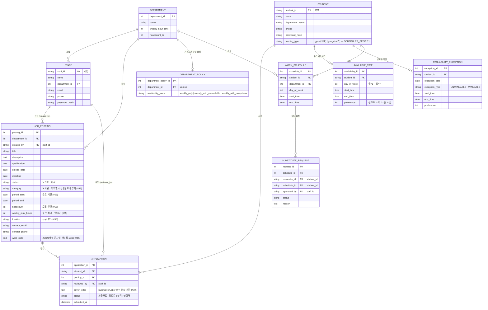

# ERD

`backend/app/models.py` 기준 (소스가 진실, 이 문서는 요약). 마지막 갱신: 2026-07-30, funding_type 컬럼 추가 시점.

## 비고

- `student.funding_type`: 근로 장학 구분. 값은 스케줄러 도메인 `FundingType`(`gyobi`/`gukga`)과 동일하며, 교비/국가별 시간 상한·휴강일 규칙 차이는 [SCHEDULER_SPEC.md](SCHEDULER_SPEC.md) 2.1 및 HC-TIME 참조. 스케줄러 DB 로더(#36) 연동 시 이 컬럼이 기준이 된다.
- "부서 소속 근로 학생" 판별: 별도 소속 테이블 없이 **해당 부서 공고에 `status="합격"`인 APPLICATION**으로 판별한다 (부서 가능시간 수합 API, 스케줄러 DB 로더 공통).
- `work_schedule`는 요일 기반이며, develop의 #48(feat-schedule-schema)에서 날짜 기반(`work_date`) + `schedule_batch`(draft→confirmed) 구조로 재설계가 진행 중 — 머지되면 이 문서도 갱신 필요.
- 마이그레이션 도구(alembic 등) 도입 전까지 스키마 변경 시 `scripts/seed_mock_data.py`의 ALTER 보정처럼 수동 대응이 필요하다.
