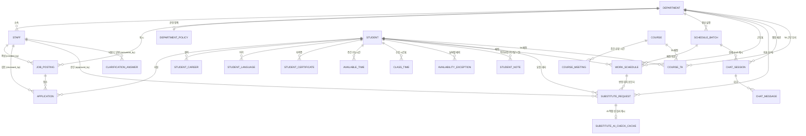
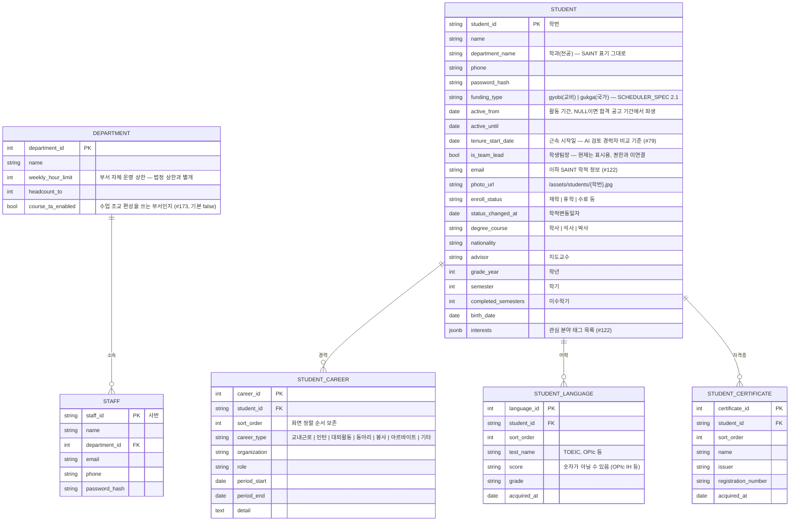
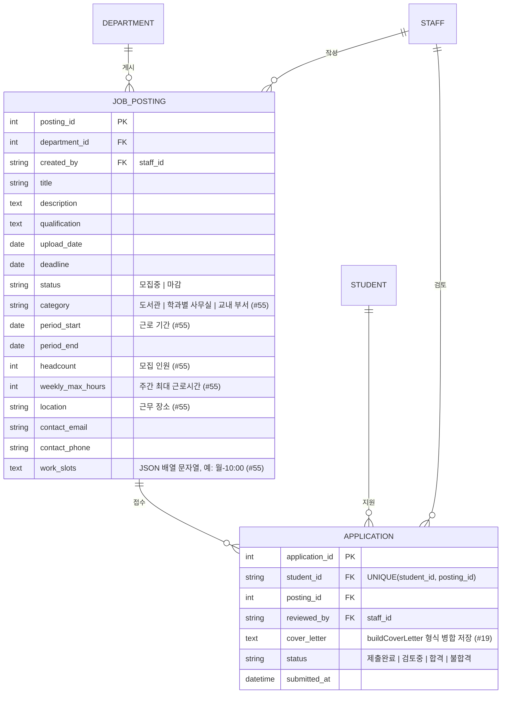
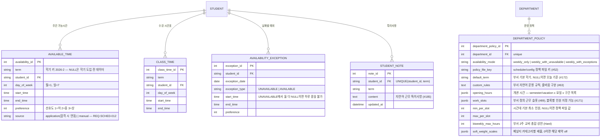
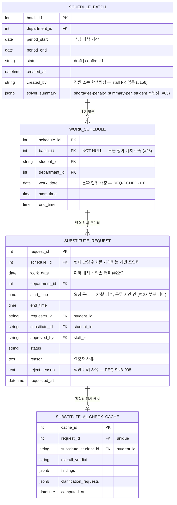
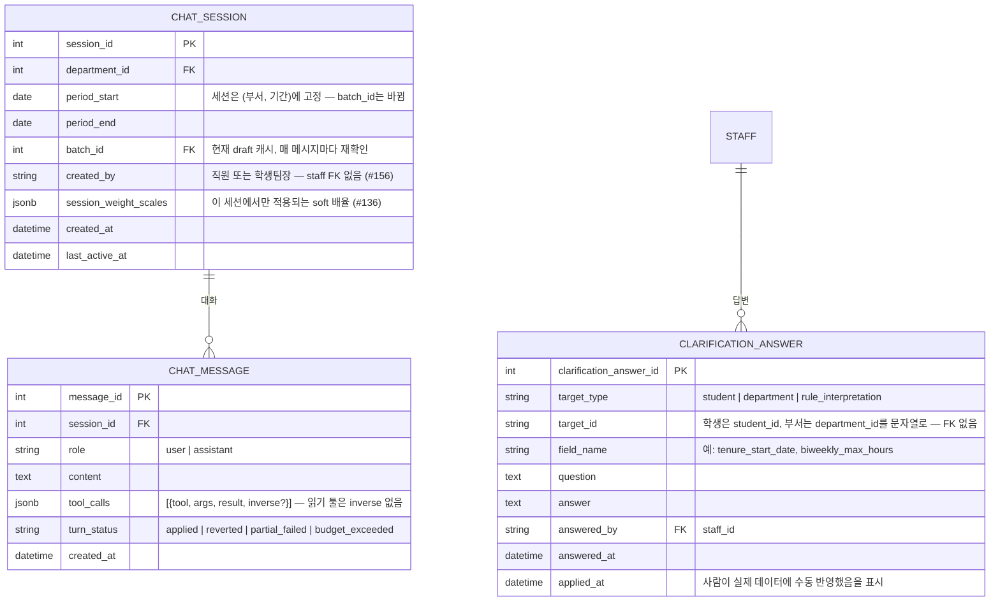
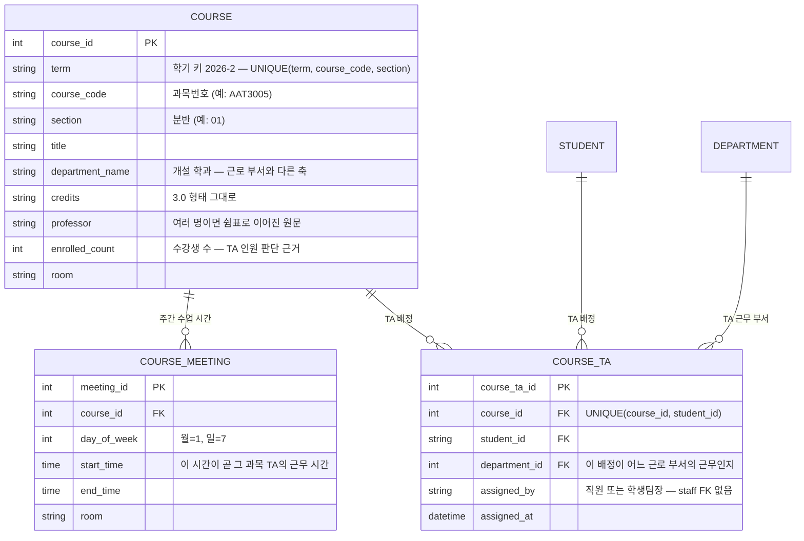

# ERD

`backend/app/models.py` 기준 (소스가 진실, 이 문서는 요약).
마지막 갱신: 2026-09-01 — 테이블 23개 전체 반영 (지원서 이력·SAINT 학적 #122, 학생 특이사항 #185, AI 되묻기·대타 AI 검사, 시간표 챗봇 #134, 개설 과목·TA #173).

전체 관계를 먼저 보고, 속성은 도메인별로 나눠서 봅니다. 한 장에 23개 테이블의 컬럼을 모두 넣으면 읽을 수 없기 때문입니다.

---

## 1. 전체 관계도

`CLARIFICATION_ANSWER`는 학생·부서 어느 쪽도 FK로 걸지 않습니다 (`target_type`+`target_id` 다형 참조, 아래 5절 참고).

---

## 2. 조직 · 계정

경력·어학·자격증(#122)은 화면 전체 저장 방식이라 갱신 시 학생별로 전량 교체합니다 (`cascade="all, delete-orphan"`).

---

## 3. 공고 · 지원

---

## 4. 가능시간 · 부서 정책

- `class_time`은 SAINT 학사 연동 전까지 학생이 직접 입력하는 임시 수단(REQ-SCHED-015)이며 선호도 개념이 없습니다. **현재 REQ-SCHED-004는 이 테이블을 참조하지 않고**, 학생이 `available_time`에서 수업 시간을 스스로 빼고 입력하는 것에 의존합니다.
- `student_note`(학생)와 `department_policy.custom_rules`(부서)는 자연어 입력이며 **솔버에 직접 들어가지 않습니다.** 제약으로 번역되는 것만 사람이 확인 후 `available_time.preference` 등으로 구조화하고, 나머지는 AI 검토·챗봇이 읽어 초안의 위반을 지적합니다.
- `availability_mode`가 달라져도 저장 구조는 모든 부서 동일합니다 — 모드 전환에 마이그레이션이 필요 없습니다.

---

## 5. 근무표 · 대타

- `schedule_batch`는 근무표 생성 1회 실행 단위입니다(REQ-SCHED-009). `generate`가 `draft` 배치를 만들고, 같은 부서·기간으로 다시 생성하면 기존 draft만 교체합니다 (`confirmed` 배치는 보존).
- **대타 요청은 배치가 아니라 좌표로 성립합니다** (#229): `(department_id, work_date, start_time, end_time, requester_id, substitute_id)`. 승인된 대타는 사람이 확정한 사실이고 근무표 배치는 재생성될 수 있는 계획이기 때문입니다. 좌표가 없던 시절에는 재확정으로 근무 행이 내려가면 승인 사실이 갈 곳을 잃었습니다 (#178).
- `substitute_request.schedule_id`는 진실이 아니라 **현재 상태의 캐시**입니다. 승인 시 원 근무 행을 요청 구간으로 좁혀 대타에게 넘기고(`_split_schedule`), 재확정 시 새 배치의 행을 가리키도록 갱신합니다(`_materialize_confirmed_rows`).
- `work_date`·`department_id`·`start_time`·`end_time`은 기존 행 보정(`schema_patches`) 때문에 nullable이며, 값 필수 여부는 API 레이어에서 지킵니다.
- AI 적합성 검사 캐시는 무효화 플래그를 두지 않고, 조회 시점에 `clarification_answer.answered_at > computed_at` 인 행이 있는지로 매번 판단합니다. 요청당 최신 1건만 유지(교체)하며 이력 보존 대상이 아닙니다.

---

## 6. AI 검토 · 시간표 챗봇

- `clarification_answer`는 **로그일 뿐**입니다 — 학생·부서의 실제 컬럼을 자동 갱신하지 않습니다. `target_type`이 학생/부서/규칙 해석으로 나뉘고 두 PK 타입이 달라 하나의 FK로 묶을 수 없어 다형 참조를 씁니다.
- 챗봇 세션을 `batch_id`가 아니라 `(부서, 기간)`에 고정하는 이유: 재생성이 draft 배치를 삭제 후 새로 만들어 `batch_id`가 매번 바뀌기 때문입니다.
- 그 턴에 무엇을 조회·수정했는지는 분류자가 아니라 `tool_calls` 목록이 말해줍니다. 쓰기 툴 항목의 `inverse`가 되돌리기(#135)의 근거입니다.

설계 문서: [review_clarification_설계문서.md](review_clarification_설계문서.md), [대타_ai적합성검사_설계문서.md](대타_ai적합성검사_설계문서.md), [시간표검토_챗봇_설계문서.md](시간표검토_챗봇_설계문서.md)

---

## 7. 개설 과목 · 수업 조교(TA)

TA 부서는 근무 단위가 시간대가 아니라 **과목**입니다. 같은 시간에 여러 과목이 열리므로(예: 금 10:30\~13:15에 4과목) 슬롯별 인원(#171)만으로는 "과목마다 TA 1명"을 표현할 수 없어 배정 축을 따로 뒀습니다 (#173).

**TA 배정은 솔버가 풀지 않습니다** — 누가 어느 수업에 들어갈지는 전공 적합성·수강 이력 같은 과목 사정이 좌우해서 담당자가 화면에서 직접 배정하고, 겹침·과목 수·근로시간 검증만 API에서 합니다. `department.course_ta_enabled`가 켜진 부서(학과·학부 사무실)만 이 화면을 씁니다.

---

## 8. 전역 규칙 · 비고

- **"부서 소속 근로 학생" 판별**: 별도 소속 테이블 없이 **해당 부서 공고에 `status="합격"`인 `application`** 으로 판별합니다 (부서 가능시간 수합 API, 스케줄러 DB 로더 공통).
- **학기 키(`term`)**: `"2026-1" | "2026-summer" | "2026-2" | "2026-winter"`. `available_time`·`class_time`·`student_note`·`course`가 같은 표기를 씁니다. NULL은 학기 도입 전 데이터입니다.
- **요일 표기**: 월=1 … 일=7. `available_time`·`class_time`·`course_meeting` 공통.
- **`work_schedule`은 날짜(`work_date`) 단위**이며 모든 행이 `schedule_batch`에 속합니다 (#48, REQ-SCHED-010). 공휴일·시험 기간에 따라 주차마다 개관 시간과 배정이 달라져 요일 반복으로는 표현할 수 없습니다.
- **`staff` FK를 걸지 않는 "작성자" 컬럼들** — `schedule_batch.created_by`, `chat_session.created_by`, `course_ta.assigned_by`. 직원일 수도 있고 학생팀장일 수도 있기 때문입니다 (#156).
- **마이그레이션 도구 부재**: alembic 등 도입 전까지 `Base.metadata.create_all`이 새 테이블만 만들고 기존 테이블에 컬럼을 추가하지 않으므로, 모델에 컬럼을 추가할 때 **`backend/app/schema_patches.py`의 목록에도 함께 올려야 합니다.** 앱 시작 시(`main.py`)와 시드 스크립트 양쪽에서 보정이 실행됩니다. 기존 행에 값을 채워야 하면 `_BACKFILLS`에 멱등한 UPDATE를 함께 올립니다.
- `student.funding_type` 값은 스케줄러 도메인 `FundingType`(`gyobi`/`gukga`)과 동일하며, 교비/국가별 시간 상한·휴강일 규칙 차이는 [SCHEDULER_SPEC.md](SCHEDULER_SPEC.md) 2.1 및 HC-TIME을 참조합니다.
